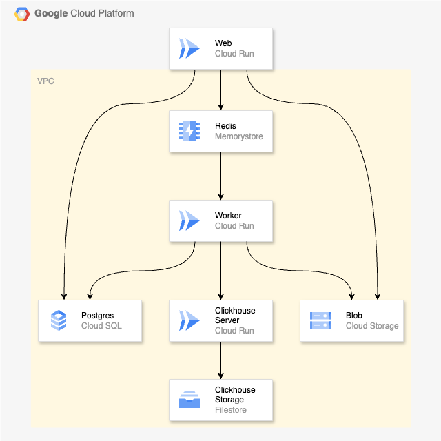

# Terraform for Langfuse Self-Hosting on Google Cloud


> [!NOTE]
> - This is an experimental project. Tracing works, but not all of Langfuse's features have been verified to work.

## Overview
Terraform configuration for self-hosting [Langfuse](https://langfuse.com/) on Google Cloud.



## Update Langfuse v2 to v3
Our `main` branch will continuously support Langfuse v3. Langfuse v3 gained a solid and scalable architecture with the latest major update. You can also access v2 at `v0.0.1` tag.

## Setup
### Features
- Sreverless hosting on Cloud Run
- Secure data persistance with 
    - Cloud SQL 
    - Memorystore for Redis
    - Cloud Storage
    - Cloud Filestore (Mounted by Clickhouse on Cloud Run)
- Secure network with VPC

### Prerequisites
- Google Cloud account
- gcloud CLI installed
- Terraform installed

### Getting Started
1. Clone the repository and move directories
    ```
    git clone https://github.com/sotazum/langfuse-google-cloud-terraform.git
    cd terraform/google/environments/dev
    ```

2. Set your own variables on `terraform.tfvars`
   - Replace the value surrounded by `< >`

3. Comment out `web` module
    ```environments/dev/main.tf
    # # At initial terraform apply, the following resource "web" should be commented out to avoid an error. After pushing the image to the artifact registry, uncomment the resource "web" and apply the terraform configuration again.
    # module "web" {
    #   source = "../../modules/web"

    #   project_id        = var.project_id
    #   region            = var.region
    #   web_repository_id = var.web_repository_id
    #   langfuse_version  = var.langfuse_version
    #   network_name      = module.vpc.network_name
    #   subnet_name       = module.vpc.subnet_name

    #   env_web = local.env_web

    #   depends_on = [ module.worker ]
    # }
    ```

4. Google auth
    ```
    gcloud auth login --update-adc
    ```

5. 1st Terraform init and apply
    ```
    terraform init
    terraform apply
    ```

6. Push custom web image
    ```
    cd ../../../../
    bash ./docker/cloudbuild.sh <your-project-id> <your-region> langfuse-web-repo 3
    ```

7. Migrate Terraform state to GCS
    ```
    terraform init -migrate-state
    ```
    - Then generate `backend.tf` and have Terraform state managed by a GCS bucket

8. Undo Comment out and 2nd Terraform apply
    ```environments/dev/main.tf
    # At initial terraform apply, the following resource "web" should be commented out to avoid an error. After pushing the image to the artifact registry, uncomment the resource "web" and apply the terraform configuration again.
    module "web" {
    source = "../../modules/web"

    project_id        = var.project_id
    region            = var.region
    web_repository_id = var.web_repository_id
    langfuse_version  = var.langfuse_version
    network_name      = module.vpc.network_name
    subnet_name       = module.vpc.subnet_name

    env_web = local.env_web

    depends_on = [ module.worker ]
    }
    ```

    ```
    terraform apply
    ```

9. Access to Langfuse

    - Check your Cloud Run URL on Google Cloud Console (default: `https://langfuse-web-<your-project-number>.<your-region>.run.app`)